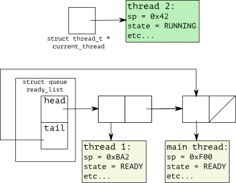

# Assignment 2: Round-Robin Scheduling

**Due Date: Friday, October 23rd**

## Overview

In the [last assignment](../assign1), we developed a mechanism for context-switching between two running threads. In order for our system to be useful, however, we'd like to extend it to deal with an arbitrary number of threads that can be dynamically created (and destroyed) during program execution.

## Design Choices

### Scheduling and State

If we are to have an arbitrary number of threads in our system, we need to make two crucial choices: first, how should we manage and store the thread control blocks associated with these threads? Second, when a thread gives up control of the CPU by finishing its task or by calling `yield()`, how should we decide which thread to run next?

Fortunately, there is a convenient data structure that can manage our thread control blocks, and implement a simple round-robin (aka FIFO) scheduling policy: a queue. When the thread finishes or yields, the scheduler will put that thread at the end of a queue of waiting threads, and pull the next thread off the front of the queue to run.

Recall that in the last assignment, we ran into trouble if a thread returned return from its initial function, and then tried to return from `thread_wrap`. The program crashed because the `ret` instruction at the end of `thread_wrap` would cause the CPU to try and pop an address off the empty thread stack and jump to it -- but since the stack was empty, that address was most likely nonsense, leading to a segmentation fault.

One potential solution to this problem is to stick a call to `yield` at the end of `thread_wrap`; however, this is not enough to prevent a crash, since another thread could call `yield` again, switching back to the point just before `thread_wrap` tries to return. We could instead put that `yield` in an infinite loop; this would cause any attempt to switch back to a finished thread to immediately switch to something else. However, this solution incurs significant penalties: the memory of the finished thread is never freed, and worse, a long-running system will be dominated by finished threads yielding to each other.

What can we do to effectively communicate the "doneness" of a thread, such that the scheduler can free its resources and never switch back to it? We can extend our thread control block to include a `state` field, which the scheduler can use to make decisions about what to do with a thread.

### The Scheduler Interface

Starting with this assignment, we'd also like to start pushing the scheduler's implementation away from application code, only connecting the two through a well-defined API (application programming interface). In the last assignment, scheduler code (such as the setup and initialization of `current_thread`) were mixed in with application code (such as printing out the results of computations). This would certainly be confusing for a user, but it is probably even more confusing for you as a library designer!

In this assignment, we'll implement the following simple scheduler API:

| | |
|---|---|
| `scheduler_begin` | to take care of one-time setup and initialization |
| `thread_fork`     | to switch among runnable threads                  |
| `yield`           | to switch among runnable threads                  |
| `scheduler_end`   | to wait for all threads in the system to finish   |

## Implementation

### Preparation

1.  Make a new directory for your second assignment. Copy your assembly code files from assignment 1 into the new directory. To save you time and let you focus on the important aspects of this assignment, I've written a simple queue ADT for you to use, which has an enqueue and dequeue function, and an `is_empty` predicate. Additionally, the dequeue function returns `NULL` if the queue is empty. Add the files [queue.h](queue.h) and [queue.c](queue.c) to your folder. It may be convenient to do this with the `wget` command in bash, e.g.:

           $ wget http://cs.pdx.edu/~kstew2/cs533/project/assign2/queue.h 
           $ wget http://cs.pdx.edu/~kstew2/cs533/project/assign2/queue.c

    Note: this queue implementation assumes your thread control block C `struct` is called `struct thread`. It should still work fine if you've created a `typedef`, as long as `struct thread` is still defined somewhere.

2.  Start a new file called `scheduler.h`, and copy in your definition for `struct thread` from the first assignment. Add prototypes for the API functions outlined above:

          void scheduler_begin();
          void thread_fork(void(*target)(void*), void * arg);
          void yield();
          void scheduler_end();

    Also, add the following declaration:

          extern struct thread * current_thread;

    This will allow any file that `#include`s `scheduler.h` to have access to the `current_thread` global variable, even though it will be defined in `scheduler.c`.

3.  Start a new file called `scheduler.c` and copy your definitions of `yield` and `thread_wrap` from the first assignment. Notice that I have not instructed you to include a prototype for `thread_wrap` in `scheduler.h` Why might this be?

4.  Here is a sample application: [main.c](main.c). Take a look at it for an idea of how your scheduler API should be used. You may use this program to test your scheduler implementation, but I encourage you to create your own tests as well!

5.  When everything is set up, your compilation line should look something like this:

          gcc main.c scheduler.c queue.c switch.s

    With whatever additional options and flags you are accustomed to using. Of course, this will not compile at this stage, since we have not implemented any of the API functions.

### Interface

1.  Add the following `enum` definition to `scheduler.h`:

          typedef enum {
            RUNNING, // The thread is currently running.
            READY,   // The thread is not running, but is runnable.
            BLOCKED, // The thread is not running, and not runnable.
            DONE     // The thread has finished. 
          } state_t;

    Extend your thread control block data structure with a new field, `state_t state`. It should go at the end of the `struct` definition to avoid interfering with our assembly code's assumptions about the layout of the structure.

2.  In `scheduler.c`, define two global variables, `struct thread * current_thread` and `struct queue ready_list`.

3.  Implement `scheduler_begin`. It should do the following:

    1.  Allocate the `current_thread` thread control block and set its state to `RUNNING`. The other fields need not be initialized; at the moment, this is an empty shell that will hold the main thread's stack pointer when it first gets switched out.
    2.  Set the `head` and `tail` fields of `ready_list` to `NULL` to indicate that the ready list is empty.
4.  Next, let's implement `thread_fork`. This function encapsulates everything necessary to allocate a new thread and then jump to it. `thread_fork` should:

    1.  Allocate a new thread control block, and allocate its stack.
    2.  Set the new thread's initial argument and initial function.
    3.  Set the current thread's state to `READY` and enqueue it on the ready list.
    4.  Set the new thread's state to `RUNNING`.
    5.  Save a pointer to the current thread in a temporary variable, then set the current thread to the new thread.
    6.  Call `thread_start` with the old current thread as `old` and the new current thread as `new`.
5.  `yield` is very similar to `thread_fork`, with the main difference being that it is pulling the next thread to run off of the ready list instead of creating it. `yield` should:

    1.  If the current thread is not `DONE`, set its state to `READY` and enqueue it on the ready list.
    2.  Dequeue the next thread from the ready list and set its state to `RUNNING`.
    3.  Save a pointer to the current thread in a temporary variable, then set the current thread to the next thread.
    4.  Call `thread_switch` with the old current thread as `old` and the new current thread as `new`.
6.  Finally, recall from the first assignment that we need a way to prevent the main thread from terminating prematurely if there are other threads still running. Implement a solution to this problem in `scheduler_end`. (Hint: you may find the `is_empty` queue function useful).

A snapshot of a running scheduler with a few threads might look something like this:

### Testing

You may use the [provided test program](main.c), or write your own. What makes this program a good test? What more could you add?

## Discussion

Think about the answers to the following questions, and discuss them with your peers if you'd like.

1.  Memory management is not included in the instructions above. Given this setup, what is an intuitive way to solve the problem of memory reclamation for thread stacks and thread control blocks? What could we do to avoid excessive allocations and deallocations?

2.  When executing scheduler code (e.g. `yield`, `thread_fork`, etc), are we running in a thread? Which thread? At what precise point can we say we have stopped running one thread's code and started running another? This is a deliberately open-ended question; just give your thoughts.

3.  What other functionality would you find useful in a threading API? Can you think of a multi-threaded application that you cannot write given this simple interface?

## What To Hand In

You should submit:

1.  All library and application code. This should include:

    *   `switch.s`
    *   `queue.h`
    *   `queue.c`
    *   `scheduler.h`
    *   `scheduler.c`
    *   `main.c`
2.  A brief written report, including:

    1.  A description of what you did and how you chose to test it.

    2.  Your responses to the discussion questions posed above. If feel like you got a good idea from a peer, make sure to cite them for it and try to give your own thoughts on their idea as well.

Please submit your code files _as-is_; do not copy them into a Word document or PDF.  
Plain text is also preferred for your write-up.

Email your submission to the TA at <u>kstew2 at cs.pdx.edu</u> on or before the due date. The subject line should be "CS533 Assignment 2".

## Need Help?

If you have any questions or concerns, or want clarification, feel free to [contact the TA](/kstew2/cs533/) by coming to office hours or sending an email.

You may also send an email to the [class mailing list](https://mailhost.cecs.pdx.edu/mailman/listinfo/cs533). Your peers will see these emails, as will the TA and professor.
