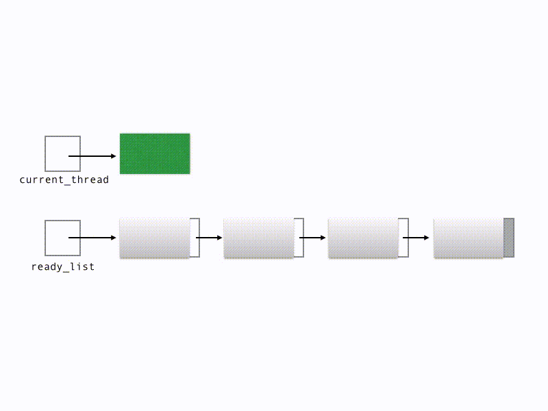

## N:1 Cooperative Round-Robin Scheduler

In an N:1 scheduler, a single kernel thread is multiplex to run many user-level threads. In a cooperative system like ours, the current user-level thread is only switched out when it calls `yield` (or blocks). Likewise, a thread on the ready list is only switched in when some other thread yields (or blocks).

In the animation below, green rectangles represent running threads, and gray rectangles represent ready threads.

