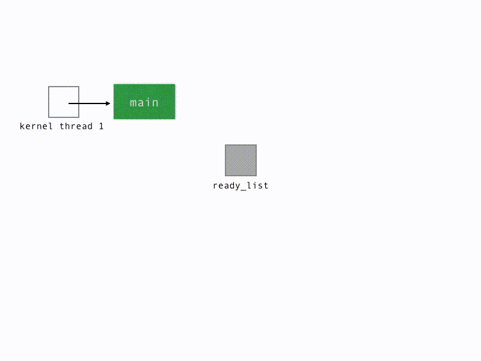

<!DOCTYPE html>
<html>
<head>
<link rel="stylesheet" href="/~kstew2/style.css" type="text/css" media="screen" title="no title" charset="utf-8">
<title>M:N Cooperative Round-Robin Scheduler</title>
</head>
<body>

<h2>M:N Cooperative Round-Robin Scheduler</h2>

One potential design makes almost no changes to the existing scheduler.
There is still just one ready queue (protected with a spinlock), 
and each new processor has an idle thread which continuously yields, pulling
work off the ready queue if it is available. User-level threads are not
preempted involuntairly, though their underlying kernel thread might be.

In the animation below, green rectangles represent running threads, and gray
rectangles represent ready threads. The infinity symbol (&#8734;) represents an
idle thread whose sole job is to <code>yield</code> in an infinite loop.

Loading diagram... please wait!

  

</body>
</html>
